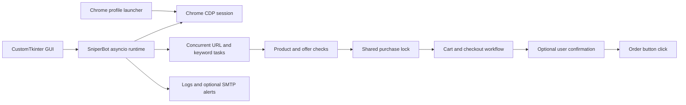

# Amazon Pokemon Sniper

A Python desktop application for monitoring Amazon US products and automating the checkout workflow. It supports product URLs and keyword searches, concurrent monitoring, per-task unit-price limits and quantities, and an optional free-shipping requirement.

Built with **Python**, **asyncio**, **Playwright**, **Chrome DevTools Protocol (CDP)** and **CustomTkinter**. Monitoring runs concurrently; purchase attempts are serialized through a shared lock because the tasks use the same Amazon cart.

## Features

- Monitor multiple product URLs or keyword searches in separate browser tabs.
- Exclude comma-separated terms from keyword search results.
- Inspect the main product offer and fall back to Buying Options.
- Check product identity and cart contents for URL tasks with a recognized ASIN.
- Set a maximum unit price, requested quantity, and free-shipping filter per task.
- Review an optional confirmation dialog before the final order button is clicked; confirmation is enabled by default.
- Configure an option to stop a task after an order attempt; see the keyword-mode limitation below.
- Reconnect the shared browser session after connection failures that reach the reconnect handler.
- View task status and activity logs in the desktop interface.
- Send optional SMTP email notifications for restocks, login requests and checkout events.

## Before running

**Starting the bot removes existing items from the connected account's cart.** With **Confirm Buy** disabled, the bot can click the final order button automatically. Confirm Buy is a final-order prompt, not a read-only mode: it does not prevent earlier cart changes.

Use the dedicated Chrome profile opened by the application and sign in manually. Login prompts and CAPTCHAs require interaction in Chrome. Review the current limitations below before using checkout automation.

## Requirements

- Python **3.10 or newer**, with Tkinter available. The existing development environment uses Python 3.12.
- Google Chrome installed.
- A desktop session capable of opening a Tk window.
- The Python packages listed in `requirements.txt`; their versions match the inspected development environment.

The source includes Chrome discovery for macOS, Windows and common Linux browser executable names. This repository upload was checked offline; it was not tested end-to-end on those operating systems.

## Installation

```bash
git clone https://github.com/AdiRevah/AmazonPokemonSniper.git
cd AmazonPokemonSniper
python3 -m venv .venv
source .venv/bin/activate
python -m pip install -r requirements.txt
python gui.py
```

On Windows PowerShell, use these environment and launch commands instead:

```powershell
py -3 -m venv .venv
.\.venv\Scripts\Activate.ps1
python -m pip install -r requirements.txt
python gui.py
```

The app connects to installed Chrome through CDP on `127.0.0.1:9226`; its normal launch path does not use Playwright's downloaded browser bundle.

If `import tkinter` fails, install a Python distribution or your operating system's Tkinter package that provides Tcl/Tk support.

## Usage

1. Run `python gui.py`.
2. Open **Accounts → Open Amazon to Login** and sign in through the dedicated Chrome window. Set the intended delivery address and payment details on Amazon.
3. In **Dashboard**, select **URL** or **KEYWORDS** and enter the product link or search terms.
4. Set **Max Price**, **Qty**, **Free Ship Only** and **Stop After Buy** for each task, then click **+ Add Task**.
5. Keep **Confirm Buy** enabled to review each final order attempt. Set the shared refresh interval and click **START SNIPER**.
6. Watch task status and logs. Complete manual login or CAPTCHA prompts in Chrome when needed, and verify any order directly on Amazon.

### Task settings

| Setting | Meaning |
| --- | --- |
| URL | Direct product URL; common `/dp/`, `/gp/product/`, `/gp/aw/d/` and `/gp/offer-listing/` paths are recognized for ASIN checks. |
| KEYWORDS | Amazon search query; each pass follows the first result with a usable link that passes the negative-keyword filter. |
| Neg. Keywords | Comma-separated terms excluded from search-result titles. |
| Max Price | Maximum **unit item price**, before shipping and tax. `0` disables this limit. |
| Qty | Requested item quantity; actual selection depends on the controls and stock Amazon exposes. |
| Refresh | Shared monitoring delay, in seconds; page loading and checkout add to the cycle time. |
| Free Ship Only | Requires shipping to be classified as free by the offer and checkout parsers. |
| Confirm Buy | Shared setting that asks before clicking the final order button; enabled by default. |
| Stop After Buy | Stops a URL task after the order button is clicked. Keyword tasks currently do not propagate this flag back from their task copy. |

Tasks are held in memory and must be added again after restarting the app. Email settings, refresh interval and confirmation preference are saved in local `settings.json`.

### Optional email alerts

Enter the SMTP server, port, sender email, password and recipient in **Settings**. Port `465` uses implicit TLS; other configured ports use STARTTLS. The implementation saves these values, including the SMTP password, as plain text in `settings.json`. That file is excluded from Git and must stay local.

### Chrome profile location

The app keeps browser login state outside the project by default:

| Platform | Default profile directory |
| --- | --- |
| macOS | `~/Library/Application Support/AmazonPokemonSniper/chrome-profile` |
| Windows | `%LOCALAPPDATA%/AmazonPokemonSniper/chrome-profile` when available |
| Linux | `$XDG_DATA_HOME/AmazonPokemonSniper/chrome-profile`, falling back to `~/.local/share/AmazonPokemonSniper/chrome-profile` |

Set `AMAZON_SNIPER_CHROME_PROFILE_DIR` to override the profile directory. An existing project-local `chrome-profile` directory is migrated on startup when possible. Browser cookies and profile data are not part of this repository.

## Architecture



| File | Responsibility |
| --- | --- |
| `gui.py` | Dashboard, task controls, settings, account login launcher and log display. |
| `bot.py` | Async monitoring, browser connection management, product and offer extraction, checkout and notifications. |
| `open_profile.py` | Chrome discovery, dedicated profile paths, legacy profile migration and browser launch. |
| `config.py` | Application metadata, Amazon US URLs and DOM selector definitions. |

## Current limitations

- **Checkout totals are displayed but are not checked against a final spending cap.** Max Price is evaluated against the extracted offer's unit price before checkout; shipping, tax, quantity changes and later price changes are not bounded by it.
- **Success means the order button was clicked.** The code does not verify an order-confirmation page or order ID before reporting success or stopping a URL task.
- **Stop After Buy does not reliably stop keyword tasks.** Keyword mode passes a copy of the task to the product workflow, so its stop flag is not copied back to the monitoring task.
- **Shipping recognition uses page text and heuristics.** It can misinterpret conditional free-delivery text or unrelated numbers. DOM selectors and a referenced Amazon Buying Options asset can also become outdated.
- **Some browser errors are caught inside task handlers.** They may be logged without reaching the shared reconnection logic.
- Tasks are not persisted. Add or remove tasks while the bot is stopped; running tasks use the task list captured at startup, and task IDs can collide after deleting and adding rows.

These are observations from the inspected source, not claims of live-site validation. The initial source upload preserves the existing application logic.

## Repository contents

The repository contains the application source, dependency list and documentation. Local settings, logs, Chrome profiles, virtual environments, generated analysis, the existing Windows executable and its `_internal` runtime bundle are excluded. A reproducible executable build recipe is not included.

## Offline verification

Python compilation and focused offline checks were run on the initial upload. They cover representative ASIN extraction, US price parsing, free/paid/unknown shipping cases, and offer rejection at a unit-price limit. No browser was launched, no Amazon account was accessed, and no purchase was attempted. These checks do not establish live checkout correctness.
